# Workflows Utilisateurs Détaillés de MintyShirt

Ce document présente les workflows utilisateurs détaillés pour les principales fonctionnalités de MintyShirt, en mettant l'accent sur l'expérience utilisateur fluide et accessible.

## 1. Workflow d'Inscription et Onboarding

### 1.1 Inscription Créateur

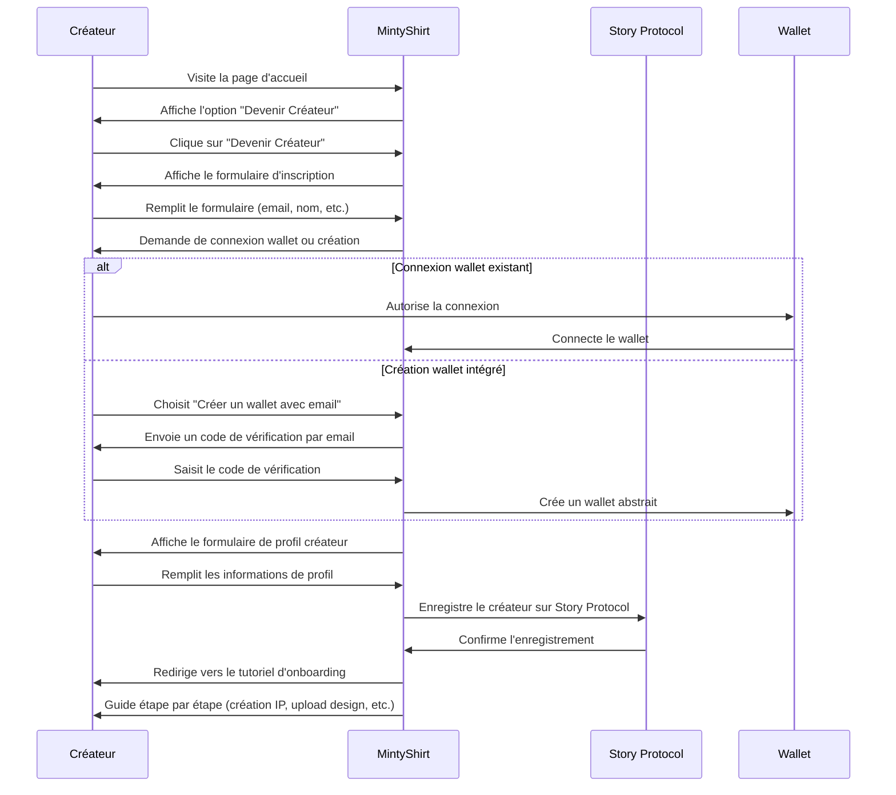
```mermaid
sequenceDiagram
    participant C as Créateur
    participant MS as MintyShirt
    participant SP as Story Protocol
    participant W as Wallet

    C->>MS: Visite la page d'accueil
    MS->>C: Affiche l'option "Devenir Créateur"
    C->>MS: Clique sur "Devenir Créateur"
    MS->>C: Affiche le formulaire d'inscription
    C->>MS: Remplit le formulaire (email, nom, etc.)
    MS->>C: Demande de connexion wallet ou création
    
    alt Connexion wallet existant
        C->>W: Autorise la connexion
        W->>MS: Connecte le wallet
    else Création wallet intégré
        C->>MS: Choisit "Créer un wallet avec email"
        MS->>C: Envoie un code de vérification par email
        C->>MS: Saisit le code de vérification
        MS->>W: Crée un wallet abstrait
    end
    
    MS->>C: Affiche le formulaire de profil créateur
    C->>MS: Remplit les informations de profil
    MS->>SP: Enregistre le créateur sur Story Protocol
    SP->>MS: Confirme l'enregistrement
    MS->>C: Redirige vers le tutoriel d'onboarding
    MS->>C: Guide étape par étape (création IP, upload design, etc.)
```

### 1.2 Inscription Client/Fan

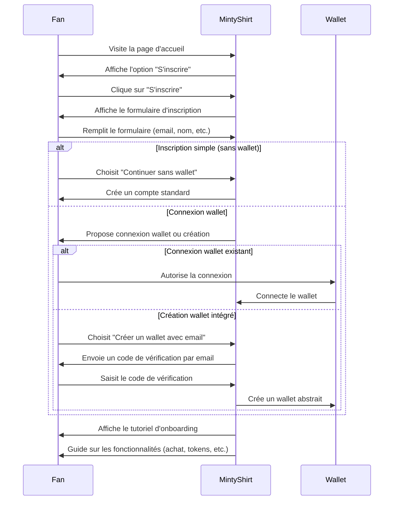
```mermaid
sequenceDiagram
    participant F as Fan
    participant MS as MintyShirt
    participant W as Wallet

    F->>MS: Visite la page d'accueil
    MS->>F: Affiche l'option "S'inscrire"
    F->>MS: Clique sur "S'inscrire"
    MS->>F: Affiche le formulaire d'inscription
    F->>MS: Remplit le formulaire (email, nom, etc.)
    
    alt Inscription simple (sans wallet)
        F->>MS: Choisit "Continuer sans wallet"
        MS->>F: Crée un compte standard
    else Connexion wallet
        MS->>F: Propose connexion wallet ou création
        alt Connexion wallet existant
            F->>W: Autorise la connexion
            W->>MS: Connecte le wallet
        else Création wallet intégré
            F->>MS: Choisit "Créer un wallet avec email"
            MS->>F: Envoie un code de vérification par email
            F->>MS: Saisit le code de vérification
            MS->>W: Crée un wallet abstrait
        end
    end
    
    MS->>F: Affiche le tutoriel d'onboarding
    MS->>F: Guide sur les fonctionnalités (achat, tokens, etc.)
```

## 2. Workflow de Création et Protection d'IP

### 2.1 Enregistrement d'un Actif IP

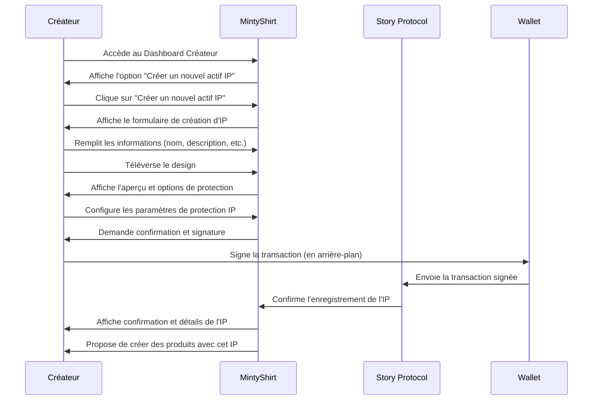
```mermaid
sequenceDiagram
    participant C as Créateur
    participant MS as MintyShirt
    participant SP as Story Protocol
    participant W as Wallet

    C->>MS: Accède au Dashboard Créateur
    MS->>C: Affiche l'option "Créer un nouvel actif IP"
    C->>MS: Clique sur "Créer un nouvel actif IP"
    MS->>C: Affiche le formulaire de création d'IP
    C->>MS: Remplit les informations (nom, description, etc.)
    C->>MS: Téléverse le design
    MS->>C: Affiche l'aperçu et options de protection
    C->>MS: Configure les paramètres de protection IP
    MS->>C: Demande confirmation et signature
    C->>W: Signe la transaction (en arrière-plan)
    W->>SP: Envoie la transaction signée
    SP->>MS: Confirme l'enregistrement de l'IP
    MS->>C: Affiche confirmation et détails de l'IP
    MS->>C: Propose de créer des produits avec cet IP
```

### 2.2 Configuration des Royalty Tokens

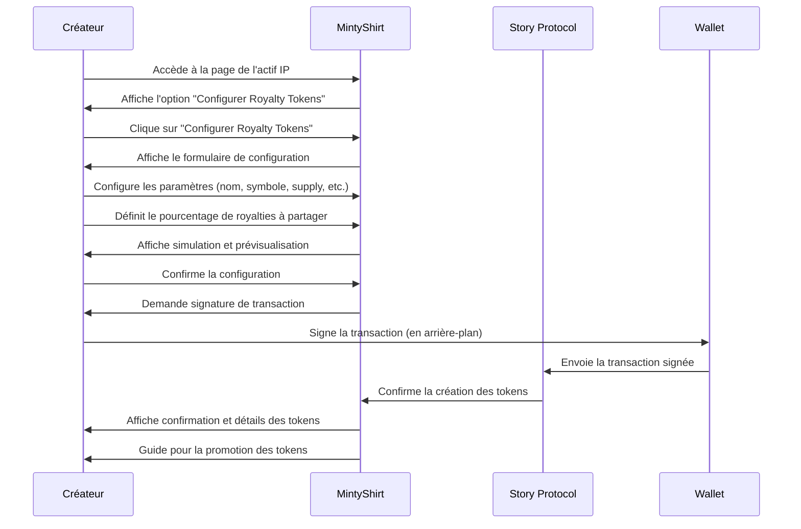
```mermaid
sequenceDiagram
    participant C as Créateur
    participant MS as MintyShirt
    participant SP as Story Protocol
    participant W as Wallet

    C->>MS: Accède à la page de l'actif IP
    MS->>C: Affiche l'option "Configurer Royalty Tokens"
    C->>MS: Clique sur "Configurer Royalty Tokens"
    MS->>C: Affiche le formulaire de configuration
    C->>MS: Configure les paramètres (nom, symbole, supply, etc.)
    C->>MS: Définit le pourcentage de royalties à partager
    MS->>C: Affiche simulation et prévisualisation
    C->>MS: Confirme la configuration
    MS->>C: Demande signature de transaction
    C->>W: Signe la transaction (en arrière-plan)
    W->>SP: Envoie la transaction signée
    SP->>MS: Confirme la création des tokens
    MS->>C: Affiche confirmation et détails des tokens
    MS->>C: Guide pour la promotion des tokens
```

## 3. Workflow de Création et Gestion de Boutique

### 3.1 Création de Produits

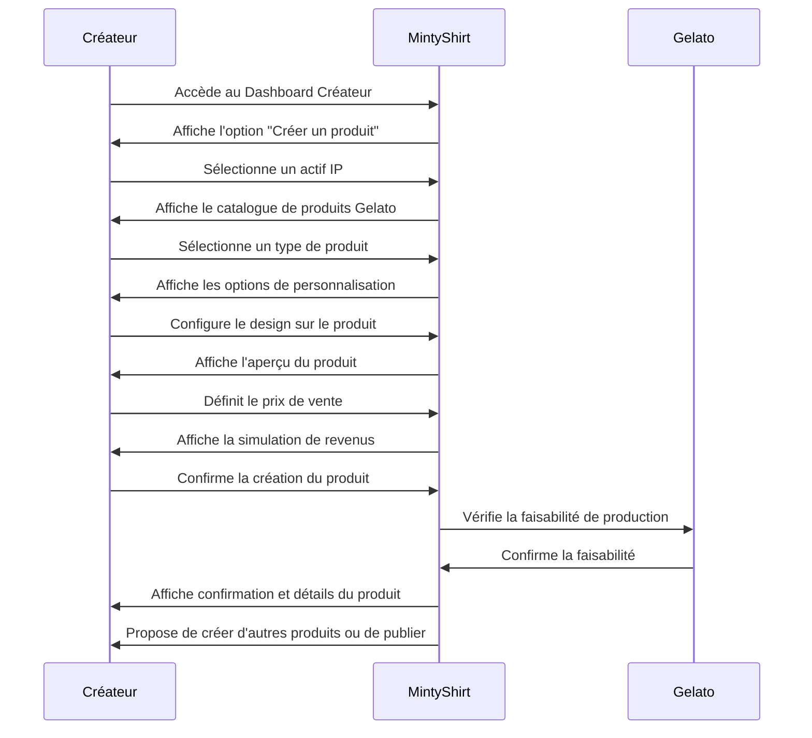
```mermaid
sequenceDiagram
    participant C as Créateur
    participant MS as MintyShirt
    participant G as Gelato

    C->>MS: Accède au Dashboard Créateur
    MS->>C: Affiche l'option "Créer un produit"
    C->>MS: Sélectionne un actif IP
    MS->>C: Affiche le catalogue de produits Gelato
    C->>MS: Sélectionne un type de produit
    MS->>C: Affiche les options de personnalisation
    C->>MS: Configure le design sur le produit
    MS->>C: Affiche l'aperçu du produit
    C->>MS: Définit le prix de vente
    MS->>C: Affiche la simulation de revenus
    C->>MS: Confirme la création du produit
    MS->>G: Vérifie la faisabilité de production
    G->>MS: Confirme la faisabilité
    MS->>C: Affiche confirmation et détails du produit
    MS->>C: Propose de créer d'autres produits ou de publier
```

### 3.2 Configuration de la Boutique

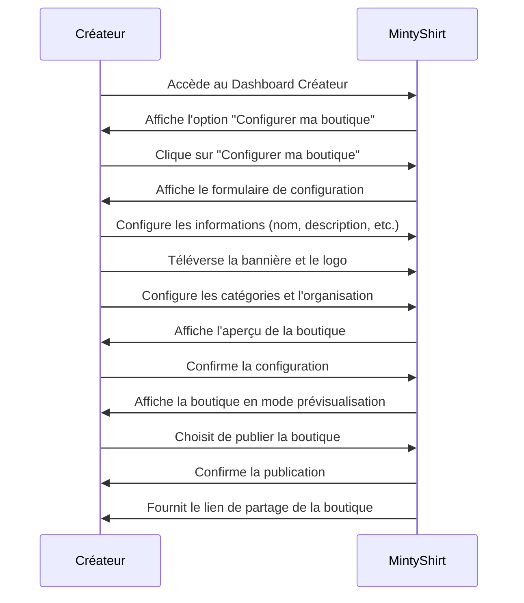
```mermaid
sequenceDiagram
    participant C as Créateur
    participant MS as MintyShirt

    C->>MS: Accède au Dashboard Créateur
    MS->>C: Affiche l'option "Configurer ma boutique"
    C->>MS: Clique sur "Configurer ma boutique"
    MS->>C: Affiche le formulaire de configuration
    C->>MS: Configure les informations (nom, description, etc.)
    C->>MS: Téléverse la bannière et le logo
    C->>MS: Configure les catégories et l'organisation
    MS->>C: Affiche l'aperçu de la boutique
    C->>MS: Confirme la configuration
    MS->>C: Affiche la boutique en mode prévisualisation
    C->>MS: Choisit de publier la boutique
    MS->>C: Confirme la publication
    MS->>C: Fournit le lien de partage de la boutique
```

## 4. Workflow d'Achat et Paiement

### 4.1 Achat de Merchandising

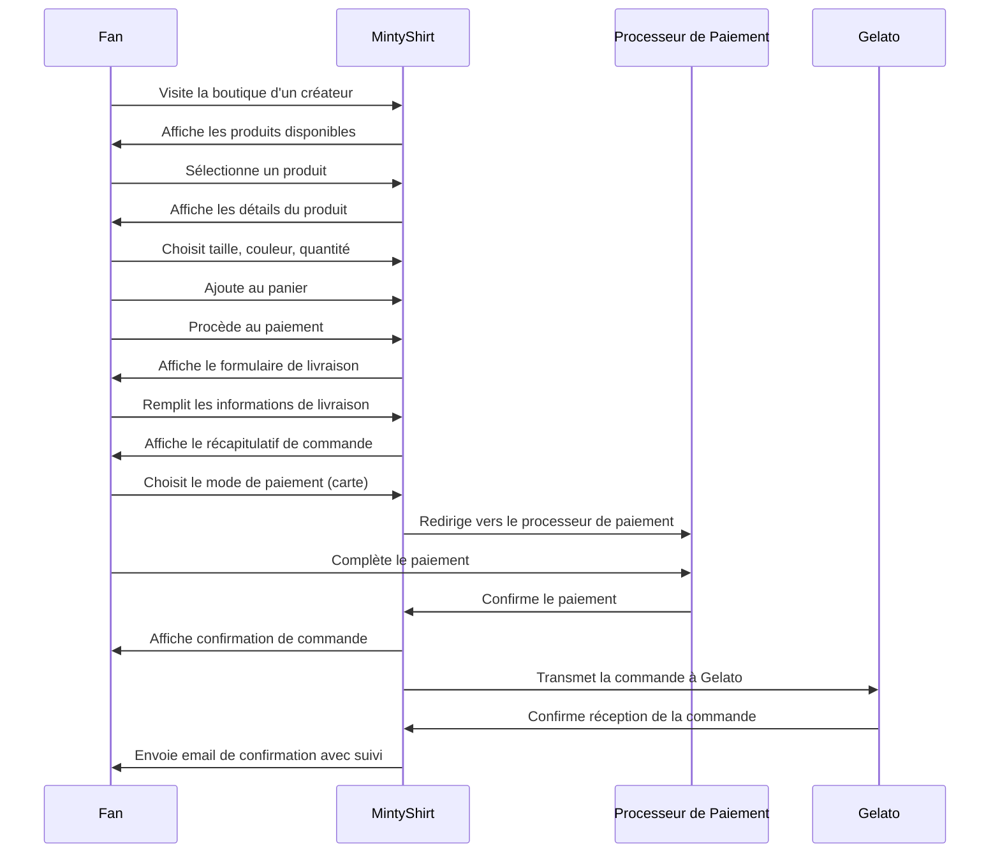
```mermaid
sequenceDiagram
    participant F as Fan
    participant MS as MintyShirt
    participant P as Processeur de Paiement
    participant G as Gelato

    F->>MS: Visite la boutique d'un créateur
    MS->>F: Affiche les produits disponibles
    F->>MS: Sélectionne un produit
    MS->>F: Affiche les détails du produit
    F->>MS: Choisit taille, couleur, quantité
    F->>MS: Ajoute au panier
    F->>MS: Procède au paiement
    MS->>F: Affiche le formulaire de livraison
    F->>MS: Remplit les informations de livraison
    MS->>F: Affiche le récapitulatif de commande
    F->>MS: Choisit le mode de paiement (carte)
    MS->>P: Redirige vers le processeur de paiement
    F->>P: Complète le paiement
    P->>MS: Confirme le paiement
    MS->>F: Affiche confirmation de commande
    MS->>G: Transmet la commande à Gelato
    G->>MS: Confirme réception de la commande
    MS->>F: Envoie email de confirmation avec suivi
```

### 4.2 Achat de Royalty Tokens

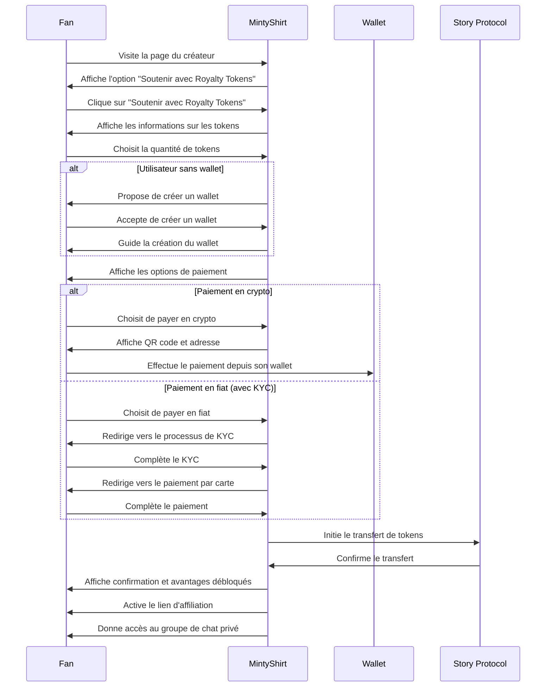
```mermaid
sequenceDiagram
    participant F as Fan
    participant MS as MintyShirt
    participant W as Wallet
    participant SP as Story Protocol

    F->>MS: Visite la page du créateur
    MS->>F: Affiche l'option "Soutenir avec Royalty Tokens"
    F->>MS: Clique sur "Soutenir avec Royalty Tokens"
    MS->>F: Affiche les informations sur les tokens
    F->>MS: Choisit la quantité de tokens
    
    alt Utilisateur sans wallet
        MS->>F: Propose de créer un wallet
        F->>MS: Accepte de créer un wallet
        MS->>F: Guide la création du wallet
    end
    
    MS->>F: Affiche les options de paiement
    
    alt Paiement en crypto
        F->>MS: Choisit de payer en crypto
        MS->>F: Affiche QR code et adresse
        F->>W: Effectue le paiement depuis son wallet
    else Paiement en fiat (avec KYC)
        F->>MS: Choisit de payer en fiat
        MS->>F: Redirige vers le processus de KYC
        F->>MS: Complète le KYC
        MS->>F: Redirige vers le paiement par carte
        F->>MS: Complète le paiement
    end
    
    MS->>SP: Initie le transfert de tokens
    SP->>MS: Confirme le transfert
    MS->>F: Affiche confirmation et avantages débloqués
    MS->>F: Active le lien d'affiliation
    MS->>F: Donne accès au groupe de chat privé
```

## 5. Workflow de Licence et Remix

### 5.1 Demande de Licence

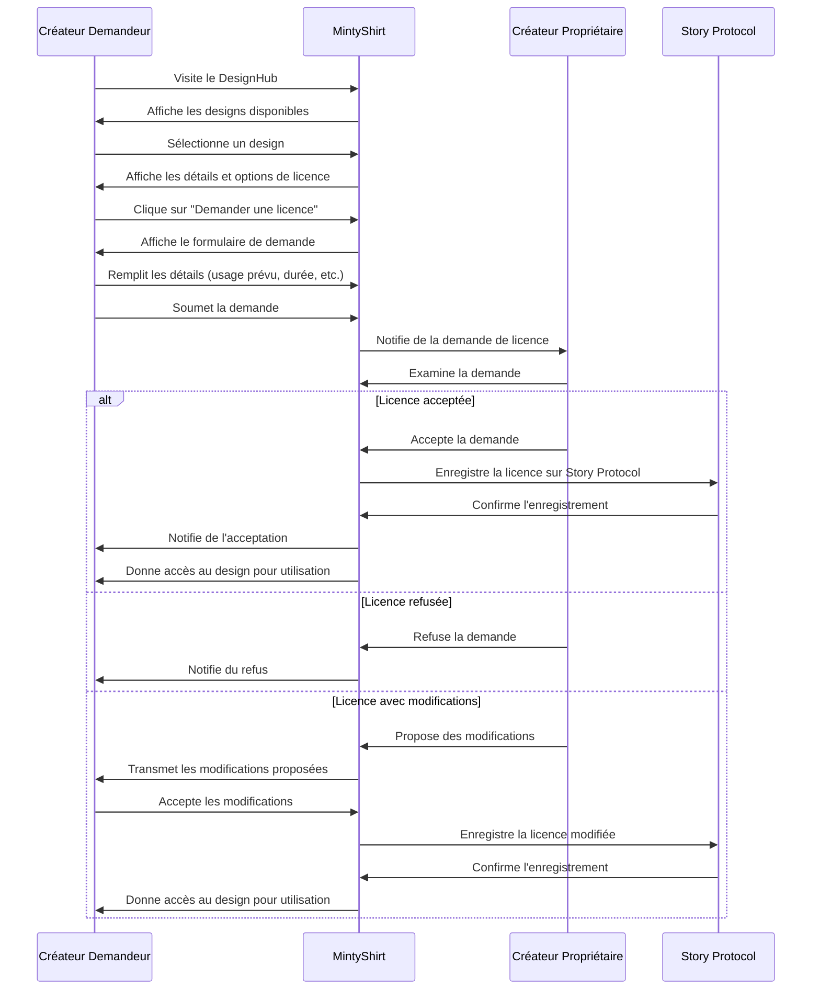
```mermaid
sequenceDiagram
    participant C1 as Créateur Demandeur
    participant MS as MintyShirt
    participant C2 as Créateur Propriétaire
    participant SP as Story Protocol

    C1->>MS: Visite le DesignHub
    MS->>C1: Affiche les designs disponibles
    C1->>MS: Sélectionne un design
    MS->>C1: Affiche les détails et options de licence
    C1->>MS: Clique sur "Demander une licence"
    MS->>C1: Affiche le formulaire de demande
    C1->>MS: Remplit les détails (usage prévu, durée, etc.)
    C1->>MS: Soumet la demande
    MS->>C2: Notifie de la demande de licence
    C2->>MS: Examine la demande
    
    alt Licence acceptée
        C2->>MS: Accepte la demande
        MS->>SP: Enregistre la licence sur Story Protocol
        SP->>MS: Confirme l'enregistrement
        MS->>C1: Notifie de l'acceptation
        MS->>C1: Donne accès au design pour utilisation
    else Licence refusée
        C2->>MS: Refuse la demande
        MS->>C1: Notifie du refus
    else Licence avec modifications
        C2->>MS: Propose des modifications
        MS->>C1: Transmet les modifications proposées
        C1->>MS: Accepte les modifications
        MS->>SP: Enregistre la licence modifiée
        SP->>MS: Confirme l'enregistrement
        MS->>C1: Donne accès au design pour utilisation
    end
```

### 5.2 Création d'un Fork (IP Enfant)

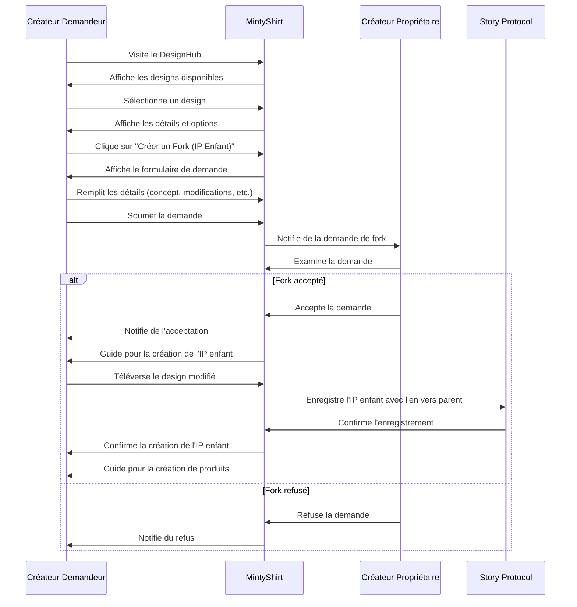
```mermaid
sequenceDiagram
    participant C1 as Créateur Demandeur
    participant MS as MintyShirt
    participant C2 as Créateur Propriétaire
    participant SP as Story Protocol

    C1->>MS: Visite le DesignHub
    MS->>C1: Affiche les designs disponibles
    C1->>MS: Sélectionne un design
    MS->>C1: Affiche les détails et options
    C1->>MS: Clique sur "Créer un Fork (IP Enfant)"
    MS->>C1: Affiche le formulaire de demande
    C1->>MS: Remplit les détails (concept, modifications, etc.)
    C1->>MS: Soumet la demande
    MS->>C2: Notifie de la demande de fork
    C2->>MS: Examine la demande
    
    alt Fork accepté
        C2->>MS: Accepte la demande
        MS->>C1: Notifie de l'acceptation
        MS->>C1: Guide pour la création de l'IP enfant
        C1->>MS: Téléverse le design modifié
        MS->>SP: Enregistre l'IP enfant avec lien vers parent
        SP->>MS: Confirme l'enregistrement
        MS->>C1: Confirme la création de l'IP enfant
        MS->>C1: Guide pour la création de produits
    else Fork refusé
        C2->>MS: Refuse la demande
        MS->>C1: Notifie du refus
    end
```

## 6. Workflow de Collaboration entre Créateurs

### 6.1 Proposition de Collaboration

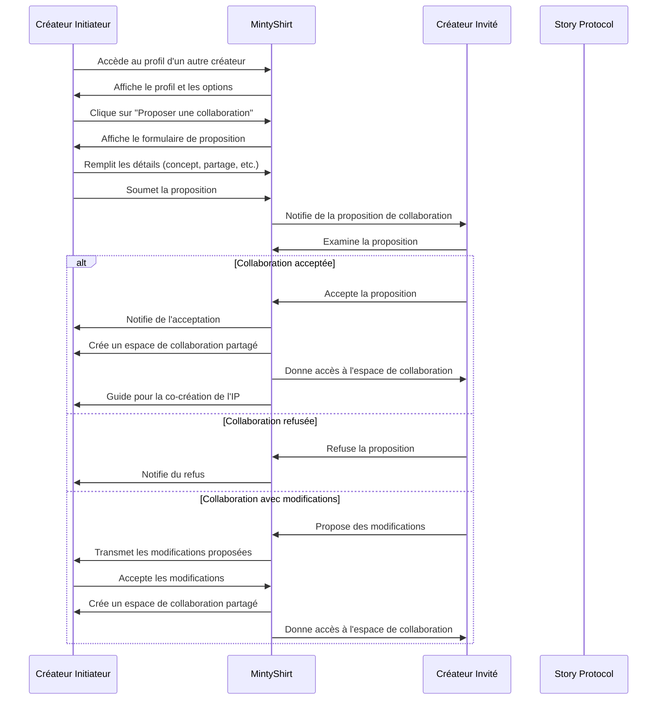
```mermaid
sequenceDiagram
    participant C1 as Créateur Initiateur
    participant MS as MintyShirt
    participant C2 as Créateur Invité
    participant SP as Story Protocol

    C1->>MS: Accède au profil d'un autre créateur
    MS->>C1: Affiche le profil et les options
    C1->>MS: Clique sur "Proposer une collaboration"
    MS->>C1: Affiche le formulaire de proposition
    C1->>MS: Remplit les détails (concept, partage, etc.)
    C1->>MS: Soumet la proposition
    MS->>C2: Notifie de la proposition de collaboration
    C2->>MS: Examine la proposition
    
    alt Collaboration acceptée
        C2->>MS: Accepte la proposition
        MS->>C1: Notifie de l'acceptation
        MS->>C1: Crée un espace de collaboration partagé
        MS->>C2: Donne accès à l'espace de collaboration
        MS->>C1: Guide pour la co-création de l'IP
    else Collaboration refusée
        C2->>MS: Refuse la proposition
        MS->>C1: Notifie du refus
    else Collaboration avec modifications
        C2->>MS: Propose des modifications
        MS->>C1: Transmet les modifications proposées
        C1->>MS: Accepte les modifications
        MS->>C1: Crée un espace de collaboration partagé
        MS->>C2: Donne accès à l'espace de collaboration
    end
```

### 6.2 Création d'un IP Commun

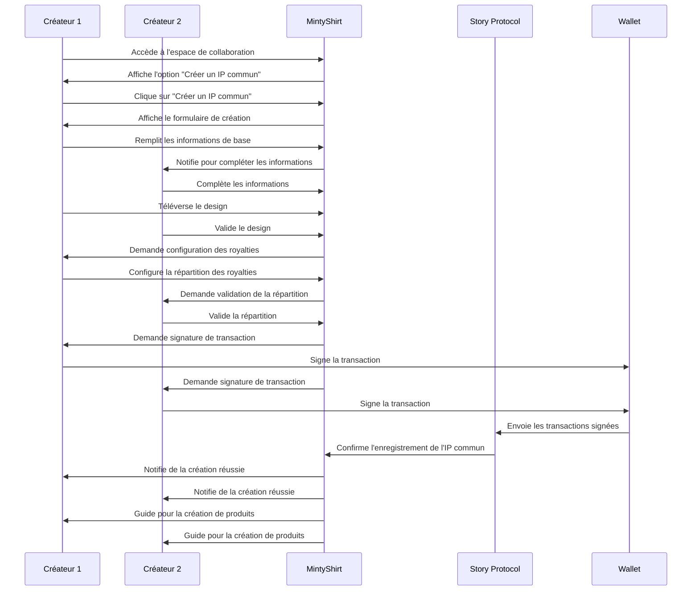
```mermaid
sequenceDiagram
    participant C1 as Créateur 1
    participant C2 as Créateur 2
    participant MS as MintyShirt
    participant SP as Story Protocol
    participant W as Wallet

    C1->>MS: Accède à l'espace de collaboration
    MS->>C1: Affiche l'option "Créer un IP commun"
    C1->>MS: Clique sur "Créer un IP commun"
    MS->>C1: Affiche le formulaire de création
    C1->>MS: Remplit les informations de base
    MS->>C2: Notifie pour compléter les informations
    C2->>MS: Complète les informations
    C1->>MS: Téléverse le design
    C2->>MS: Valide le design
    MS->>C1: Demande configuration des royalties
    C1->>MS: Configure la répartition des royalties
    MS->>C2: Demande validation de la répartition
    C2->>MS: Valide la répartition
    MS->>C1: Demande signature de transaction
    C1->>W: Signe la transaction
    MS->>C2: Demande signature de transaction
    C2->>W: Signe la transaction
    W->>SP: Envoie les transactions signées
    SP->>MS: Confirme l'enregistrement de l'IP commun
    MS->>C1: Notifie de la création réussie
    MS->>C2: Notifie de la création réussie
    MS->>C1: Guide pour la création de produits
    MS->>C2: Guide pour la création de produits
```

## 7. Workflow de Whitelisting et Ventes Privées

### 7.1 Configuration d'une Vente Privée

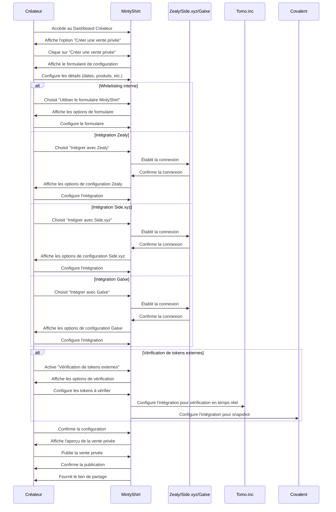
```mermaid
sequenceDiagram
    participant C as Créateur
    participant MS as MintyShirt
    participant Z as Zealy/Side.xyz/Galxe
    participant T as Tomo.inc
    participant CV as Covalent

    C->>MS: Accède au Dashboard Créateur
    MS->>C: Affiche l'option "Créer une vente privée"
    C->>MS: Clique sur "Créer une vente privée"
    MS->>C: Affiche le formulaire de configuration
    C->>MS: Configure les détails (dates, produits, etc.)
    
    alt Whitelisting interne
        C->>MS: Choisit "Utiliser le formulaire MintyShirt"
        MS->>C: Affiche les options de formulaire
        C->>MS: Configure le formulaire
    else Intégration Zealy
        C->>MS: Choisit "Intégrer avec Zealy"
        MS->>Z: Établit la connexion
        Z->>MS: Confirme la connexion
        MS->>C: Affiche les options de configuration Zealy
        C->>MS: Configure l'intégration
    else Intégration Side.xyz
        C->>MS: Choisit "Intégrer avec Side.xyz"
        MS->>Z: Établit la connexion
        Z->>MS: Confirme la connexion
        MS->>C: Affiche les options de configuration Side.xyz
        C->>MS: Configure l'intégration
    else Intégration Galxe
        C->>MS: Choisit "Intégrer avec Galxe"
        MS->>Z: Établit la connexion
        Z->>MS: Confirme la connexion
        MS->>C: Affiche les options de configuration Galxe
        C->>MS: Configure l'intégration
    end
    
    alt Vérification de tokens externes
        C->>MS: Active "Vérification de tokens externes"
        MS->>C: Affiche les options de vérification
        C->>MS: Configure les tokens à vérifier
        MS->>T: Configure l'intégration pour vérification en temps réel
        MS->>CV: Configure l'intégration pour snapshot
    end
    
    C->>MS: Confirme la configuration
    MS->>C: Affiche l'aperçu de la vente privée
    C->>MS: Publie la vente privée
    MS->>C: Confirme la publication
    MS->>C: Fournit le lien de partage
```

### 7.2 Participation à une Vente Privée

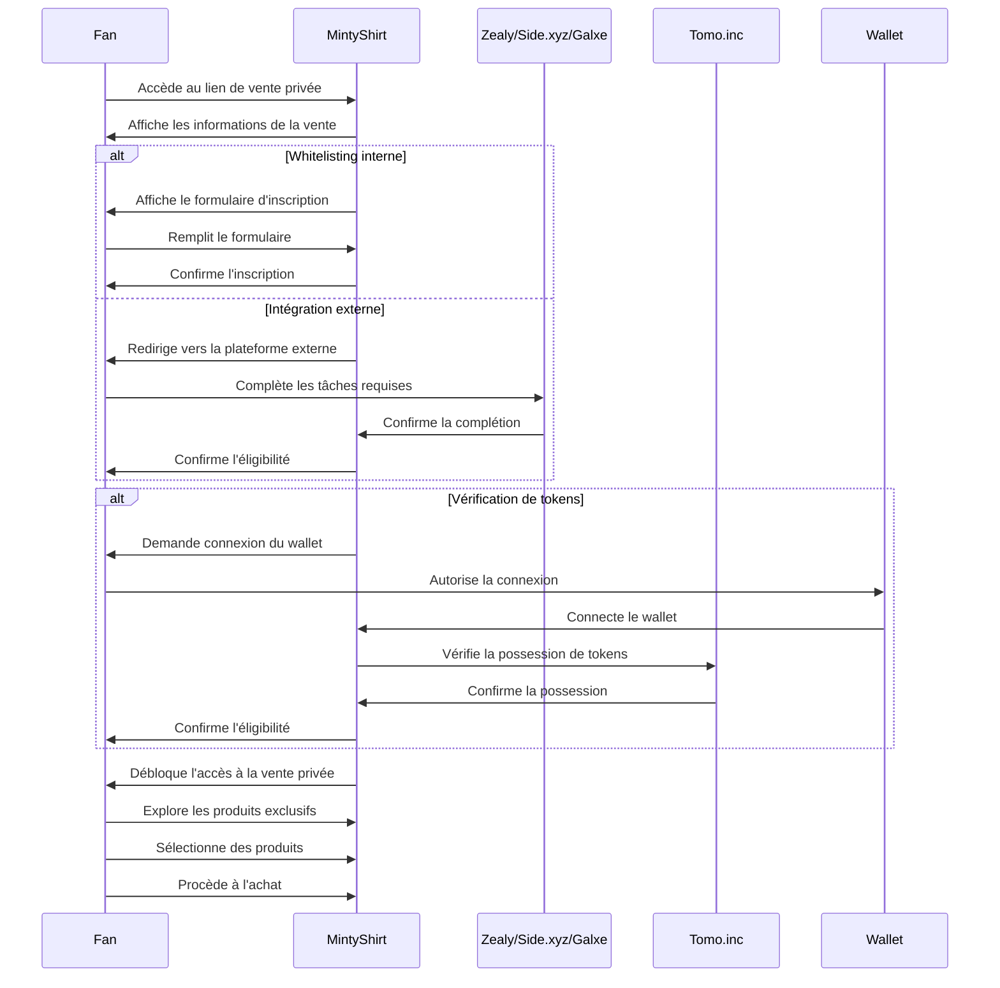
```mermaid
sequenceDiagram
    participant F as Fan
    participant MS as MintyShirt
    participant Z as Zealy/Side.xyz/Galxe
    participant T as Tomo.inc
    participant W as Wallet

    F->>MS: Accède au lien de vente privée
    MS->>F: Affiche les informations de la vente
    
    alt Whitelisting interne
        MS->>F: Affiche le formulaire d'inscription
        F->>MS: Remplit le formulaire
        MS->>F: Confirme l'inscription
    else Intégration externe
        MS->>F: Redirige vers la plateforme externe
        F->>Z: Complète les tâches requises
        Z->>MS: Confirme la complétion
        MS->>F: Confirme l'éligibilité
    end
    
    alt Vérification de tokens
        MS->>F: Demande connexion du wallet
        F->>W: Autorise la connexion
        W->>MS: Connecte le wallet
        MS->>T: Vérifie la possession de tokens
        T->>MS: Confirme la possession
        MS->>F: Confirme l'éligibilité
    end
    
    MS->>F: Débloque l'accès à la vente privée
    F->>MS: Explore les produits exclusifs
    F->>MS: Sélectionne des produits
    F->>MS: Procède à l'achat
```

## 8. Workflow de Gestion des Royalties et Revenus

### 8.1 Distribution des Royalties

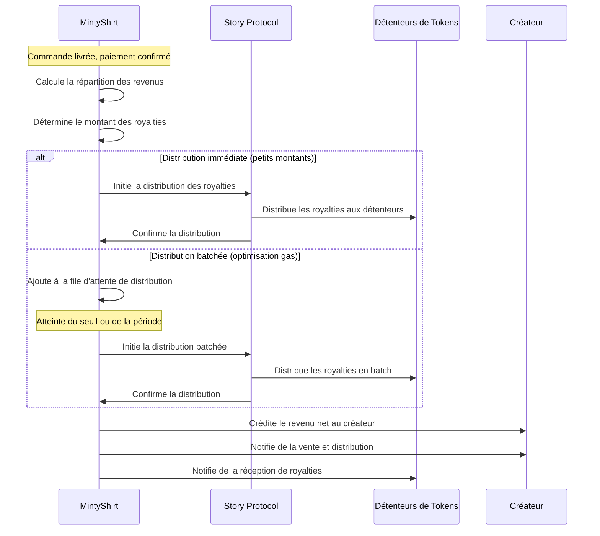
```mermaid
sequenceDiagram
    participant MS as MintyShirt
    participant SP as Story Protocol
    participant H as Détenteurs de Tokens
    participant C as Créateur

    Note over MS: Commande livrée, paiement confirmé
    MS->>MS: Calcule la répartition des revenus
    MS->>MS: Détermine le montant des royalties
    
    alt Distribution immédiate (petits montants)
        MS->>SP: Initie la distribution des royalties
        SP->>H: Distribue les royalties aux détenteurs
        SP->>MS: Confirme la distribution
    else Distribution batchée (optimisation gas)
        MS->>MS: Ajoute à la file d'attente de distribution
        Note over MS: Atteinte du seuil ou de la période
        MS->>SP: Initie la distribution batchée
        SP->>H: Distribue les royalties en batch
        SP->>MS: Confirme la distribution
    end
    
    MS->>C: Crédite le revenu net au créateur
    MS->>C: Notifie de la vente et distribution
    MS->>H: Notifie de la réception de royalties
```

### 8.2 Consultation des Revenus et Royalties

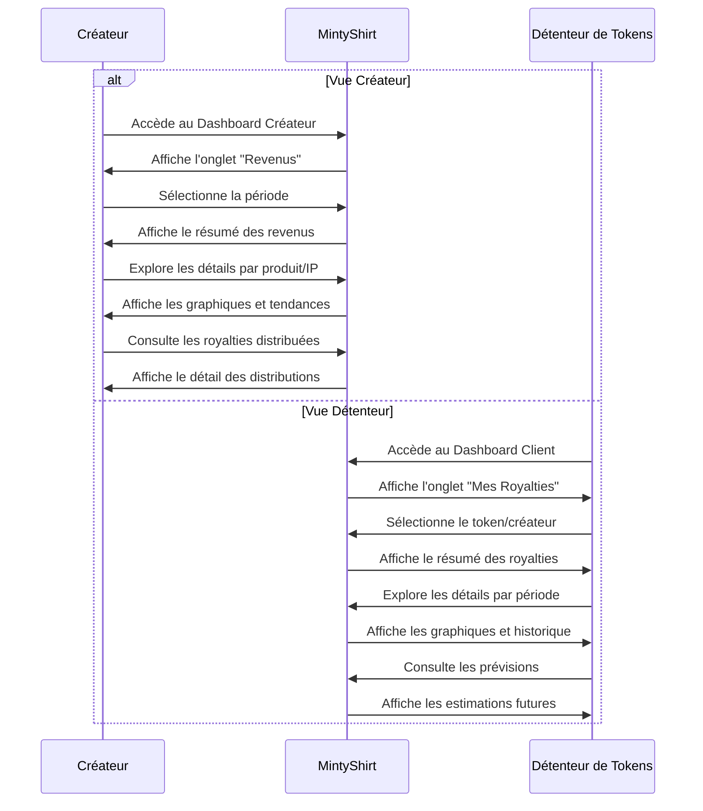
```mermaid
sequenceDiagram
    participant C as Créateur
    participant MS as MintyShirt
    participant H as Détenteur de Tokens

    alt Vue Créateur
        C->>MS: Accède au Dashboard Créateur
        MS->>C: Affiche l'onglet "Revenus"
        C->>MS: Sélectionne la période
        MS->>C: Affiche le résumé des revenus
        C->>MS: Explore les détails par produit/IP
        MS->>C: Affiche les graphiques et tendances
        C->>MS: Consulte les royalties distribuées
        MS->>C: Affiche le détail des distributions
    else Vue Détenteur
        H->>MS: Accède au Dashboard Client
        MS->>H: Affiche l'onglet "Mes Royalties"
        H->>MS: Sélectionne le token/créateur
        MS->>H: Affiche le résumé des royalties
        H->>MS: Explore les détails par période
        MS->>H: Affiche les graphiques et historique
        H->>MS: Consulte les prévisions
        MS->>H: Affiche les estimations futures
    end
```

## 9. Workflow de Chat Privé Token-Gated

### 9.1 Configuration du Chat Privé

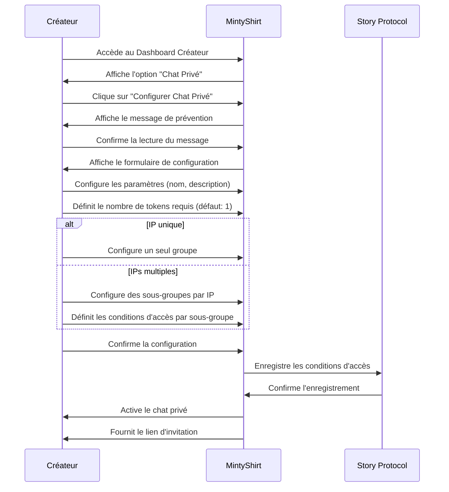
```mermaid
sequenceDiagram
    participant C as Créateur
    participant MS as MintyShirt
    participant SP as Story Protocol

    C->>MS: Accède au Dashboard Créateur
    MS->>C: Affiche l'option "Chat Privé"
    C->>MS: Clique sur "Configurer Chat Privé"
    MS->>C: Affiche le message de prévention
    C->>MS: Confirme la lecture du message
    MS->>C: Affiche le formulaire de configuration
    C->>MS: Configure les paramètres (nom, description)
    C->>MS: Définit le nombre de tokens requis (défaut: 1)
    
    alt IP unique
        C->>MS: Configure un seul groupe
    else IPs multiples
        C->>MS: Configure des sous-groupes par IP
        C->>MS: Définit les conditions d'accès par sous-groupe
    end
    
    C->>MS: Confirme la configuration
    MS->>SP: Enregistre les conditions d'accès
    SP->>MS: Confirme l'enregistrement
    MS->>C: Active le chat privé
    MS->>C: Fournit le lien d'invitation
```

### 9.2 Accès et Utilisation du Chat Privé

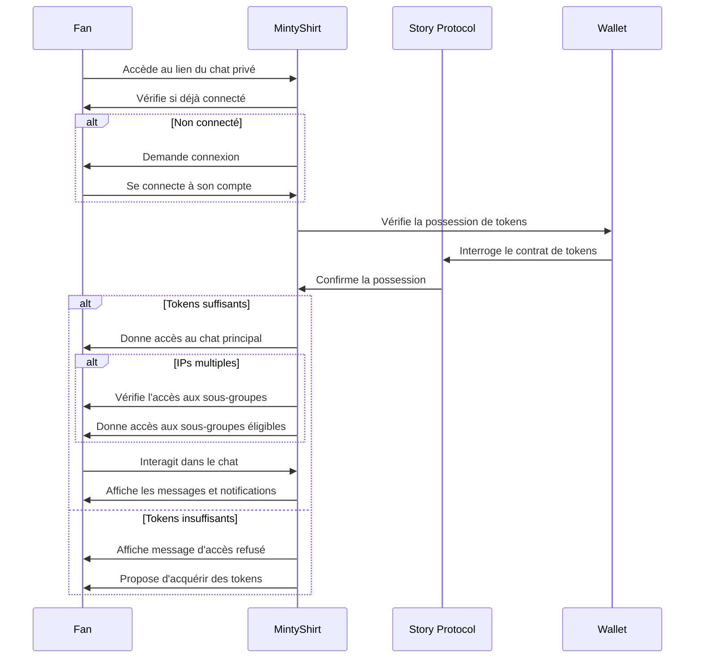
```mermaid
sequenceDiagram
    participant F as Fan
    participant MS as MintyShirt
    participant SP as Story Protocol
    participant W as Wallet

    F->>MS: Accède au lien du chat privé
    MS->>F: Vérifie si déjà connecté
    
    alt Non connecté
        MS->>F: Demande connexion
        F->>MS: Se connecte à son compte
    end
    
    MS->>W: Vérifie la possession de tokens
    W->>SP: Interroge le contrat de tokens
    SP->>MS: Confirme la possession
    
    alt Tokens suffisants
        MS->>F: Donne accès au chat principal
        
        alt IPs multiples
            MS->>F: Vérifie l'accès aux sous-groupes
            MS->>F: Donne accès aux sous-groupes éligibles
        end
        
        F->>MS: Interagit dans le chat
        MS->>F: Affiche les messages et notifications
    else Tokens insuffisants
        MS->>F: Affiche message d'accès refusé
        MS->>F: Propose d'acquérir des tokens
    end
```

## 10. Workflow d'Affiliation Token-Gated

### 10.1 Génération et Gestion des Liens d'Affiliation

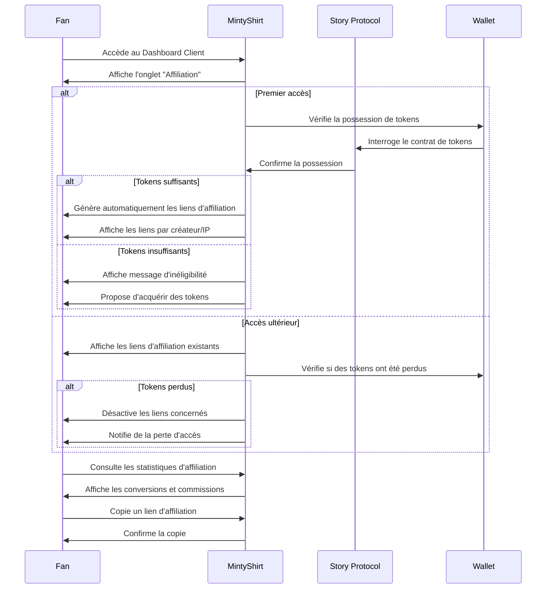
```mermaid
sequenceDiagram
    participant F as Fan
    participant MS as MintyShirt
    participant SP as Story Protocol
    participant W as Wallet

    F->>MS: Accède au Dashboard Client
    MS->>F: Affiche l'onglet "Affiliation"
    
    alt Premier accès
        MS->>W: Vérifie la possession de tokens
        W->>SP: Interroge le contrat de tokens
        SP->>MS: Confirme la possession
        
        alt Tokens suffisants
            MS->>F: Génère automatiquement les liens d'affiliation
            MS->>F: Affiche les liens par créateur/IP
        else Tokens insuffisants
            MS->>F: Affiche message d'inéligibilité
            MS->>F: Propose d'acquérir des tokens
        end
    else Accès ultérieur
        MS->>F: Affiche les liens d'affiliation existants
        MS->>W: Vérifie si des tokens ont été perdus
        
        alt Tokens perdus
            MS->>F: Désactive les liens concernés
            MS->>F: Notifie de la perte d'accès
        end
    end
    
    F->>MS: Consulte les statistiques d'affiliation
    MS->>F: Affiche les conversions et commissions
    F->>MS: Copie un lien d'affiliation
    MS->>F: Confirme la copie
```

### 10.2 Utilisation d'un Lien d'Affiliation

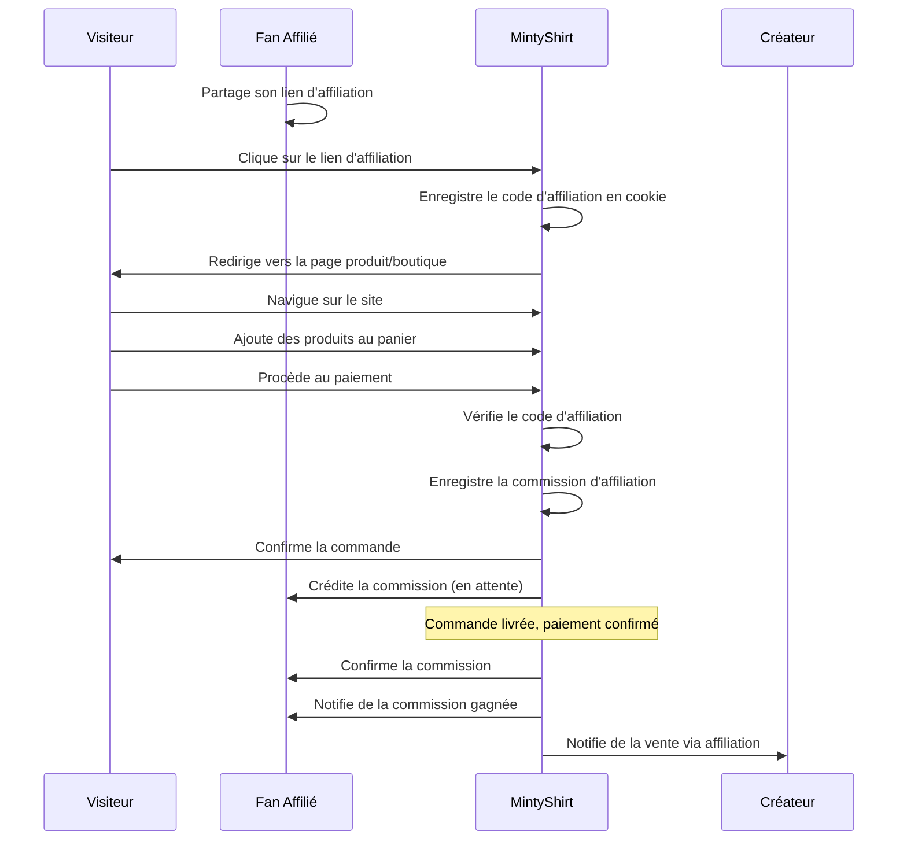
```mermaid
sequenceDiagram
    participant V as Visiteur
    participant F as Fan Affilié
    participant MS as MintyShirt
    participant C as Créateur

    F->>F: Partage son lien d'affiliation
    V->>MS: Clique sur le lien d'affiliation
    MS->>MS: Enregistre le code d'affiliation en cookie
    MS->>V: Redirige vers la page produit/boutique
    V->>MS: Navigue sur le site
    V->>MS: Ajoute des produits au panier
    V->>MS: Procède au paiement
    MS->>MS: Vérifie le code d'affiliation
    MS->>MS: Enregistre la commission d'affiliation
    MS->>V: Confirme la commande
    MS->>F: Crédite la commission (en attente)
    
    Note over MS: Commande livrée, paiement confirmé
    
    MS->>F: Confirme la commission
    MS->>F: Notifie de la commission gagnée
    MS->>C: Notifie de la vente via affiliation
```

## 11. Workflow de Gestion des Designs et Produits

### 11.1 Mise à Jour d'un Design

```mermaid
sequenceDiagram
    participant C as Créateur
    participant MS as MintyShirt
    participant SP as Story Protocol

    C->>MS: Accède au Dashboard Créateur
    MS->>C: Affiche la liste des designs
    C->>MS: Sélectionne un design à modifier
    MS->>C: Affiche les détails du design
    C->>MS: Clique sur "Modifier"
    MS->>C: Affiche les options modifiables
    
    alt Modification mineure (métadonnées)
        C->>MS: Modifie les métadonnées
        MS->>SP: Met à jour les métadonnées
        SP->>MS: Confirme la mise à jour
    else Nouvelle version du design
        C->>MS: Téléverse la nouvelle version
        MS->>C: Affiche la comparaison
        C->>MS: Confirme la nouvelle version
        MS->>SP: Enregistre la nouvelle version
        SP->>MS: Confirme l'enregistrement
    end
    
    MS->>C: Confirme les modifications
    MS->>C: Propose de mettre à jour les produits
```

### 11.2 Gestion des Produits

```mermaid
sequenceDiagram
    participant C as Créateur
    participant MS as MintyShirt
    participant G as Gelato

    C->>MS: Accède au Dashboard Créateur
    MS->>C: Affiche la liste des produits
    
    alt Ajout de produit
        C->>MS: Clique sur "Ajouter un produit"
        MS->>C: Affiche le catalogue Gelato
        C->>MS: Sélectionne un produit
        MS->>C: Guide la personnalisation
        C->>MS: Configure le produit
        MS->>G: Vérifie la faisabilité
        G->>MS: Confirme la faisabilité
        MS->>C: Confirme l'ajout du produit
    else Modification de produit
        C->>MS: Sélectionne un produit existant
        MS->>C: Affiche les détails du produit
        C->>MS: Modifie les paramètres
        MS->>G: Vérifie la faisabilité
        G->>MS: Confirme la faisabilité
        MS->>C: Confirme les modifications
    else Suppression de produit
        C->>MS: Sélectionne un produit existant
        MS->>C: Affiche les détails du produit
        C->>MS: Clique sur "Supprimer"
        MS->>C: Demande confirmation
        C->>MS: Confirme la suppression
        MS->>C: Confirme la suppression
    end
```

## 12. Workflow de Suivi de Commande

### 12.1 Suivi par le Client

```mermaid
sequenceDiagram
    participant F as Fan
    participant MS as MintyShirt
    participant G as Gelato
    participant C as Transporteur

    F->>MS: Accède au Dashboard Client
    MS->>F: Affiche l'onglet "Mes Commandes"
    F->>MS: Sélectionne une commande
    MS->>F: Affiche les détails de la commande
    F->>MS: Clique sur "Suivi de livraison"
    MS->>G: Demande les informations de suivi
    G->>MS: Fournit les informations de suivi
    MS->>C: Demande le statut détaillé
    C->>MS: Fournit le statut détaillé
    MS->>F: Affiche le statut et l'historique
    MS->>F: Affiche la carte de suivi
    MS->>F: Affiche la date estimée de livraison
```

### 12.2 Suivi par le Créateur

```mermaid
sequenceDiagram
    participant C as Créateur
    participant MS as MintyShirt
    participant G as Gelato

    C->>MS: Accède au Dashboard Créateur
    MS->>C: Affiche l'onglet "Commandes"
    C->>MS: Applique des filtres (période, statut)
    MS->>C: Affiche la liste des commandes filtrées
    C->>MS: Sélectionne une commande
    MS->>C: Affiche les détails de la commande
    C->>MS: Clique sur "Statut de production"
    MS->>G: Demande le statut de production
    G->>MS: Fournit le statut détaillé
    MS->>C: Affiche le statut et l'historique
    MS->>C: Affiche les dates estimées
```

## Prochaines Étapes

1. **Développement des maquettes interactives**
   - Création de wireframes détaillés pour chaque écran
   - Développement de prototypes interactifs
   - Tests utilisateurs des flux principaux

2. **Implémentation des workflows backend**
   - Développement des API nécessaires
   - Intégration avec les smart contracts
   - Tests d'intégration

3. **Développement des interfaces utilisateur**
   - Implémentation des composants UI
   - Intégration des flux de données
   - Tests de performance et d'accessibilité
